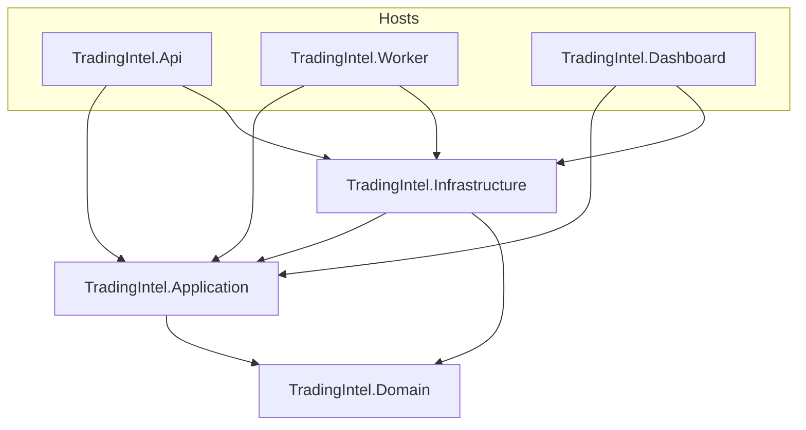

# TradingIntel

Solution inicial em .NET 9 para uma plataforma de trading intelligence (EA FC 26), organizada em camadas com hosts separados para API, worker e painel.

## Arquitetura

O fluxo de dependências segue a regra do repositório: **Domain → Application → Infrastructure → Api / Worker / Dashboard**.



| Projeto | Papel |
| --- | --- |
| **Domain** | Modelos, invariantes e value objects. Sem dependências de infraestrutura. |
| **Application** | Casos de uso, orquestração, interfaces (ports). Depende apenas de Domain. |
| **Infrastructure** | Implementações concretas (HTTP, persistência, filas), parsers, mappers. Depende de Domain e Application. |
| **Api** | ASP.NET Core: contratos HTTP, composição de DI, health checks. Sem lógica de domínio em controllers (neste bootstrap não há controllers; use casos de uso na Application e mantenha endpoints finos). |
| **Worker** | `BackgroundService` / hosted services para ingestão e jobs. |
| **Dashboard** | Host web do painel operacional (shell inicial). |
| **Tests** | xUnit + FluentAssertions; inclui teste de integração do health check da Api. |

Documentação complementar: pasta [`docs/`](docs/).

## Pré-requisitos

- [.NET 9 SDK](https://dotnet.microsoft.com/download/dotnet/9.0)

## Comandos

```powershell
dotnet build TradingIntel.sln
dotnet test TradingIntel.sln
dotnet run --project src/TradingIntel.Api
```

Com a Api em execução, o endpoint de saúde responde em `/health` (HTTP 200).

## Convenções

- EditorConfig na raiz (C#, JSON, Markdown).
- Toda alteração relevante deve incluir atualização mínima em `docs/` (ver `.cursor/rules/project-rule.md`).
